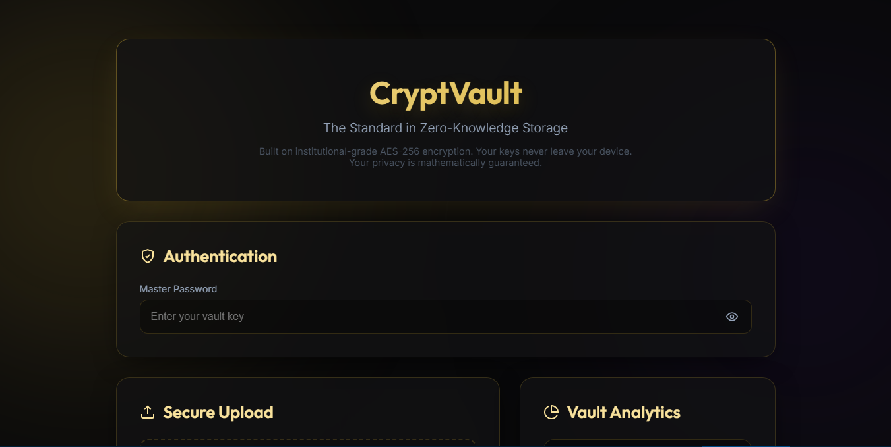
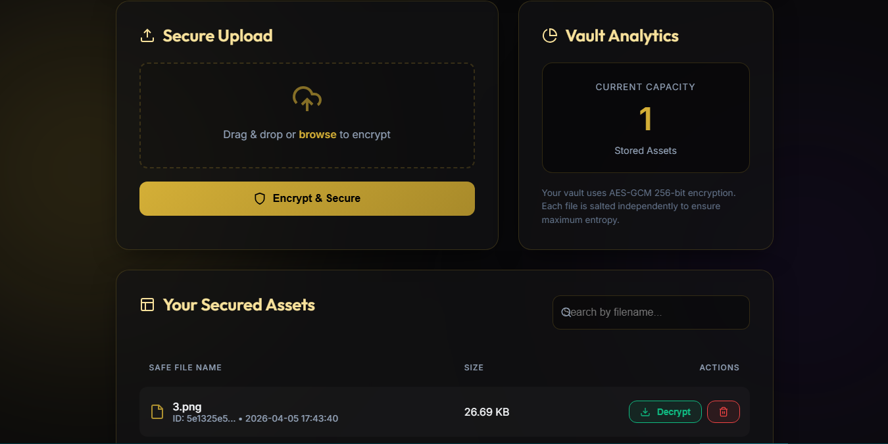

# 🔒 CryptVault — Lightweight Edition

> **Zero-Trust Encrypted File Storage System** 

CryptVault encrypts your files locally using **AES-256-GCM** before they ever touch physical storage. The master password never leaves your machine—ensuring complete privacy and guaranteeing that the storage backend has zero access to your data. Designed to be fast, highly-secure, and exceptionally lightweight, focusing purely on zero trust storage without any bloat.

---

## 📑 Table of Contents

- [Features](#-features)
- [Requirements](#-requirements)
- [Installation](#-installation)
- [Usage (CLI & Web)](#-usage)
- [Project Structure](#-project-structure)
- [Security Model](#-security-model)
- [Testing](#-running-tests)
- [Warnings](#-warnings)

---

## ✨ Features

- **AES-256-GCM Encryption**: Military-grade authenticated encryption for all stored files.
- **Argon2id Key Derivation**: RFC 9106 compliant password hashing (CLI).
- **TOTP Two-Factor Auth**: Mandatory 2FA via Authenticator Apps.
- **Master Password Verification**: Password correctness is locally checked via HMAC before decryption.
- **Premium Web UI**: Stunning dark-themed **Glassmorphism** interface with real-time encryption/decryption status.
- **Ultra Lightweight**: Pure Python footprint with zero unnecessary background dependencies.

---

## Preview 

1.


2.  


---

## 📋 Requirements

- **Python** 3.10 or higher
- **pip** (Python package manager)

---

## 🚀 Installation

### 1. Clone the repository

```bash
git clone https://github.com/your-username/cryptvault.git
cd cryptvault
```

### 2. Create a virtual environment

**Linux / macOS:**
```bash
python3 -m venv venv
source venv/bin/activate
```

**Windows:**
```cmd
python -m venv venv
venv\Scripts\activate
```

### 3. Install dependencies

```bash
pip install -r requirements.txt
pip install -e .
```

---

## 💻 Usage

CryptVault uses pure Python execution keeping systems extremely portable without needing localized shell wrappers. 

### CLI Commands

| Command | Description |
|---------|-------------|
| `python run.py cli init` | Initialize a new vault (sets master password + 2FA) |
| `python run.py cli store <file>` | Encrypt and store a file |
| `python run.py cli retrieve <id>` | Decrypt and download a file by its UUID |
| `python run.py cli list` | List all stored files (metadata access only) |
| `python run.py cli delete <id>` | Permanently delete a file from the vault |

---

### Web UI

Start the web server locally:
```bash
python run.py web 
```

Then open **http://127.0.0.1:8000** in your browser.

The Web UI features a modern, high-end experience:
- **Premium Glassmorphism**: A sleek, dark-mode interface with blurred panels and glowing accents.
- **Secure Uploads** — Files are encrypted directly in your browser tab before network transmission.
- **Instant Decryption** — Decrypt and download files on-demand without the server ever seeing your key.
- **Vault Management** — Easily track and delete secured blobs with a simplified, intuitive layout.

> **Note:** Your master password fundamentally never leaves the browser interface. The server only stores the encoded ciphertext. Also, CLI and Web UI use different key derivation functions. Files encrypted via one interface cannot be decrypted by the other (the system catches this automatically).

---

## 📁 Project Structure

```
cryptvault/
├── cryptvault/              # Main package
│   ├── cli/                 # Command-line interface
│   ├── core/                # Core business & Crypto logic
│   └── web/                 # FastAPI Endpoints & Client-side UI
├── tests/                   # Pytest Suites for verification
├── run.py                   # Central Python Runner 
├── setup.py                 # Package setup
└── requirements.txt         # Package dependencies
```

---

## 🛡 Security Model

- **Zero-Trust**: The server (and Web UI backend) never receives your master password or plaintext data.
- **AES-256-GCM**: Authenticated encryption ensures both confidentiality and integrity against byte manipulation.
- **Argon2id (CLI)**: Memory-hard KDF resistant to GPU/ASIC brute-force attacks (RFC 9106).
- **PBKDF2 (Web UI)**: Advanced robust loops directly embedded into pure JS Crypto integrations. 
- **TOTP 2FA**: Time-based one-time passwords with ±1 window for local clock drift tolerance.
- **Password Verification**: Master password authenticity is checked via robust HMAC matching arrays before any decryption phase is authorized.
- **Per-file salts**: Each file uploads with highly-unique RNG salts ensuring 0 key collisions.

---

## 🧪 Running Tests

```bash
# Execute local unit-tests mapped around Auth & Encryption pipelines
python -m pytest tests/ -v
```

---

## ⚠️ Warnings

> **🔑 Do Not Lose Your Master Password**
> This is a true zero-trust system — there is **no password recovery module built in whatsoever**. If you lose your password and your 2FA device, your data is mathematically sealed and inaccessible.

---

## 🔮 Future Scope
CryptVault is built for the security-conscious, and its evolution will focus on expanding accessibility without compromising the zero-trust architecture:

- **Mobile Companion App:** Bringing the power of client-side encryption to iOS and Android with biometric (FaceID/TouchID) vault unlocking.
- **Decentralized Storage Integration:** Option to store encrypted blobs on IPFS or Sia for true censorship-resistant file hosting.
- **Multi-Algorithm Support:** Let users choose between AES-GCM, ChaCha20-Poly1305, or even Post-Quantum Cryptography (PQC) standards.
- **Real-time Collaboration:** Securely share "V-Links" (Vault Links) where the decryption key is part of the URL fragment (not sent to server).
- **Two-Factor Authentication (2FA) for Web:** Add support for FIDO2/WebAuthn hardware keys in the browser interface.

## 🤝 Contributing
Contributions are welcome! If you find a bug or have a feature request, please open an issue.

## 📄 License
This project is licensed under the MIT License - see the [LICENSE](LICENSE) file for details.
